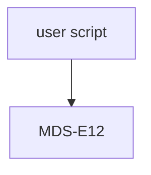

# MiniDisc interface module for the MDS-E12
The MDS-E12 has a build in RS232 port, like several other sudio line MiniDisc player. This interface can be used to control the player from a computer.
This interface module enables the user to interact with the player in such a way that fully automated recording on the MiniDisc is possible.

# Modules used and interaction

