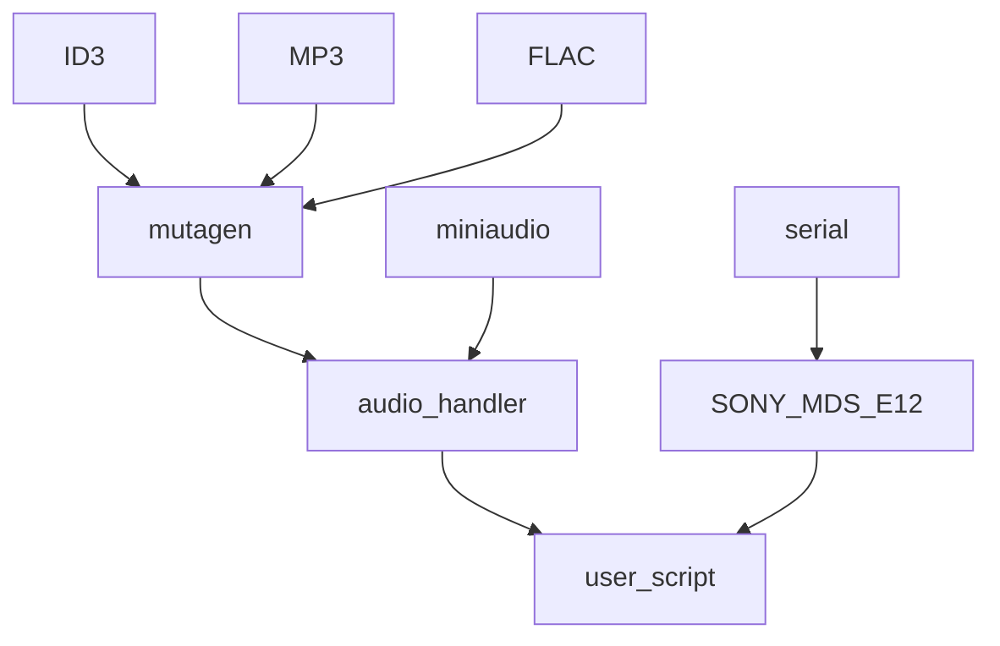
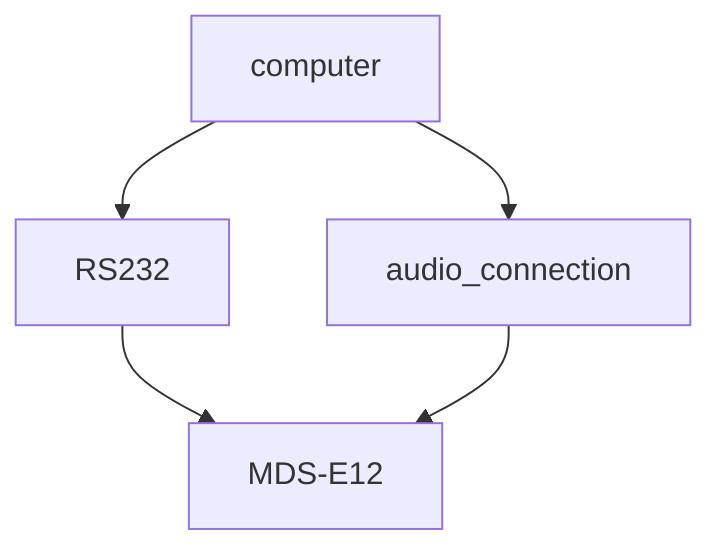

# MiniDisc interface module for the MDS-E12
The MDS-E12 has a build in RS232 port, like several other sudio line MiniDisc player. This interface can be used to control the player from a computer.
This interface module enables the user to interact with the player in such a way that fully automated recording on the MiniDisc is possible.

# Modules used and interaction

## mutagen
ID3, MP3 and FLAC are used from mutagen to extract metadata information from MP3 or FLAC files.
This is the title and artist to form later the track title for the MiniDisc.
Also the track length as we need that for our timer as the player we are using is not blocking.

## miniaudio
The miniaudio module is used to playback the track that we want to record on the MiniDisc.

# Connections
The following connections need to be made between the computer and the MDS-E12.

